# Sports Architecture Audit

> **Read-only audit.** No application source file was created, modified, moved or deleted.
> The only file written is this report (plus the `docs/` directory that holds it).
> Every claim below cites a path. Anything not established by reading files is marked
> **[Inference]** or **“Not confirmed from repository inspection.”**
> Audit date: 2026-08-28. Branch inspected: `development`.

---

## 1. Executive Summary

**Current architecture, in brief**

- Laravel 12 / PHP ^8.2 monolith (`composer.json`). **There is no React application anywhere in this repository** — the frontend is server-rendered Blade + Alpine.js + jQuery + Tailwind 4, built by Vite (`package.json` has no `react`/`react-dom`/`@vitejs/plugin-react`; `resources/js/` contains only `app.js`, `bootstrap.js`, `client-paginator.js`, `realtime.js`). The brief's premise of a React frontend does not match the repository.
- A genuine plug-in architecture **already exists** for competition: `App\Events\Contracts\EventType` (an ~18-method vertical contract), `App\Events\EventTypeRegistry`, wired in exactly one file, `config/event_types.php`, with per-package views/lang auto-bound by `App\Events\EventPackageServiceProvider`.
- A second, older registry also exists for *sports* (as opposed to event types): `App\Sports\Combat\CombatSport` + `App\Sports\Combat\SportRegistry`, wired in `config/combat.php`. Two registries coexist deliberately (`app/Events/EventTypeRegistry.php` docblock) but they overlap.
- Two sports have real competition packages: **Karate** (`app/Events/Sports/Karate/`) and **Taekwondo** (`app/Events/Sports/Taekwondo/`), each owning its scoring engine, mat state, court-display fleet, running order, draw advancement and screens. Two cross-sport event types also exist: `app/Events/Sparring/` and `app/Events/OpenMat/`.
- **Brazilian Jiu-Jitsu has no competition implementation.** `bjj` appears only as a catalogue row in `config/event_schema.php:63` and as activity-directory marketing content in `database/seeders/ActivityContentSeederB.php`. Any BJJ event today falls through to `App\Events\Generic\GenericEvent`.
- Karate and Taekwondo were created by **copying** the package: `Arrangement.php`, `Roster.php`, `RunningOrder.php`, `Enrolment.php` and `CallNotifier.php` are byte-identical between the two once the sport name is normalised (measured: 0 differing lines across ~1,008 lines).
- Live scoring is **server-authoritative** — the console posts *intentions* (`{command:'score', side, action}`), never totals (`app/Events/Sports/*/Tournament/resources/views/scoreboard/control.blade.php`, `send()`), and all rules run in `Scoring::apply()`.
- Running match state is **not in the database** — it is a cache blob (`MatState::load/save` via `Cache::` with a 240-minute TTL) on the `file` cache store (`.env` `CACHE_STORE=file`). An append-only officiating trail *does* exist in `event_match_events` (`database/migrations/2026_08_19_000000_create_event_match_events_table.php`), but it is best-effort and explicitly swallows its own failures.
- Realtime is MQTT (`packages/takeone/realtime`, EMQX per `docker/realtime`), publish-from-server / subscribe-only in the browser; wall screens run a hand-written MQTT client inside a Web Worker (`.../court-display/partials/screen-link.blade.php`).
- Database is **SQLite** (`.env` `DB_CONNECTION=sqlite`; CI also uses SQLite). A MySQL connection is pre-configured but unused (`config/database.php`, and CLAUDE.md's Pre-Launch Runbook).

**Maturity assessment**

Above average for a single-vendor competition platform, and unusually self-aware: the boundary rule is written down (`CLAUDE.md` → “Events Are Self-Contained Packages — STRICT”; `Documentation/EVENTS.md`) and largely honoured in the *newest* code. Maturity is uneven, though — the contract is strong, the duplication between the two implemented sports is severe, and the highest-consequence subsystem in the product (live scoring, which decides official results) has **no automated test of a single scoring rule**.

**Top 3 risks**

1. **No test asserts any scoring rule.** No test anywhere mentions `gamjeom`, `senshu`, `ippon`, `award_round` or `golden` (grep over `tests/`). Karate and Taekwondo scoring are ~1,800 lines of match-deciding logic with zero rule coverage.
2. **Live match state is a file-cache blob with a TTL** (`app/Events/Sports/*/Tournament/Scoreboard/MatState.php`). A cache flush, a 240-minute overrun, or a second web node loses the live score of a bout in progress; nothing reconstructs it from `event_match_events`.
3. **Copy-paste sports.** A bug fixed in `app/Events/Sports/Taekwondo/Tournament/RunningOrder.php` is not fixed in the byte-identical Karate twin — the classic divergence risk, already realised once (see `app/Events/Support/HallScreenRouter.php`'s own docblock describing a Karate console writing a Taekwondo device row).

**Top 3 opportunities**

1. The `EventType` contract is good enough to be the permanent boundary; the work is *filling it in*, not designing it.
2. `event_match_events` is already an append-only, sport-tagged command log — the substrate for replayable, auditable, reversible scoring already exists and is under-used (it is written but never read back by the scoring path).
3. The identical collaborators (`Arrangement`, `Roster`, `RunningOrder`, `Enrolment`, `CallNotifier`) can be lifted into a shared `Tournament` kernel with almost no behavioural risk, because they are literally the same code.

**Recommended direction (one paragraph)**

Do not rewrite. The repository is already a modular monolith with a working registry; what it lacks is (a) a shared *bracketed-combat tournament kernel* under the existing `EventType` contract, so a new sport is a thin subclass plus a rules object rather than a 4,000-line copy; (b) a persisted, versioned ruleset and a durable match-state store so an official result never depends on a cache entry; and (c) rule-level tests as the safety net that makes any of the above movable. The pilot should be **Karate**, because it is the sport that was most recently copied (so the diff to a shared kernel is smallest and best understood) while Taekwondo stays the untouched control. BJJ should be built *after* the kernel exists — it is the proof that the kernel works, and it is greenfield, so it costs nothing to defer.

---

## 2. Repository Profile

### Stack and versions

| Layer | Evidence | Value |
|---|---|---|
| PHP | `composer.json` → `require.php` | `^8.2` |
| Framework | `composer.json` → `laravel/framework` | `^12.0` |
| Auth | `laravel/sanctum ^4.0`, `pragmarx/google2fa-laravel ^3.0` | Sanctum + optional 2FA |
| Queue/ops | `laravel/horizon ^5.45`, `sentry/sentry-laravel ^4.22`, `spatie/laravel-activitylog ^4.12` | Horizon, Sentry, activity log |
| Integration | `laravel/mcp ^0.8.2` | MCP server (`app/Mcp/`) |
| Other | `bacon/bacon-qr-code`, `phpoffice/phpspreadsheet`, `fivefilters/readability.php` | QR, spreadsheets, article parsing |
| First-party pkgs | `packages/takeone/realtime` (path repo, symlinked), `takeone/cropper` (VCS repo) | MQTT realtime; image cropper |
| Frontend build | `package.json` → `vite ^7`, `laravel-vite-plugin ^2`, `@tailwindcss/vite ^4` | Vite + Tailwind 4 |
| Frontend libs | `package.json` → `jquery ^3.7.1`, `chart.js ^4.5.1`, `select2`, `mqtt ^5.15.1`, `jquery-cropbox`, `axios`, `browser-image-compression` | jQuery-era stack |
| **React** | **absent** from `package.json`; no `.jsx/.tsx` under `resources/`; no `createRoot`/`from 'react'` anywhere in `resources/` | **Not present** |
| TypeScript | absent (no `tsconfig.json`, no `.ts` app sources) | Plain JS |
| Alpine.js | loaded in Blade layouts; used pervasively (e.g. `resources/views/personal/event-create.blade.php`) | Yes — **[Inference]** from usage, not from `package.json` (delivered via CDN or layout include; not confirmed which) |

### Backend/frontend relationship

Server-rendered **Blade monolith** with progressive enhancement, not an SPA and not Inertia. Two SPA-*like* navigation shells exist and are hand-written, not framework-provided:

- desktop admin: `resources/views/partials/admin-shell-nav.blade.php` (intercepts `a[data-shell-link]`, swaps `<main data-shell-main>`),
- mobile: `resources/views/partials/mobile-shell-nav.blade.php` (swaps `#shell-content`, keyed by `data-shell-id`).

397 Blade templates under `resources/views/`, plus 30 more shipped *inside* the event packages (`app/Events/**/resources/views/`), namespaced by `App\Events\EventPackageServiceProvider` as `event-<key>::` and `sport-<sport>::`.

### Build, test, deployment, realtime tooling

- **CI:** `.github/workflows/ci.yml` — PHP 8.2, `composer install`, `.env.example`, `php artisan migrate --force` against a fresh SQLite file, `npm ci`, `npm run build`, then the test suite. No static analysis, no linting step, no coverage gate (Pint is a dev dependency but is **not** invoked in CI).
- **Deployment:** `.github/workflows/deploy.yml`, `.github/workflows/deploy-staging.yml` (self-hosted runner; `CLAUDE.md` and repo memory describe staging = this box, production = a separate host).
- **Realtime:** `packages/takeone/realtime` (`RealtimeManager`, `Mqtt/PhpMqttPublisher`, `Mqtt/TokenIssuer`, `Support/Topics`, `resources/js/realtime.js`), broker compose under `docker/realtime`. Browser client is **subscribe-only** (`resources/js/realtime.js:12`).
- **Queue/cache/session:** `QUEUE_CONNECTION=database`, `SESSION_DRIVER=database`, `CACHE_STORE=file`, `DB_CONNECTION=sqlite` (values read from `.env`; no secret values reproduced).
- **Native apps in-repo:** `mobile/` (Capacitor WebView shell of the live site), `TV/` (Flutter — hall-screen kiosk, tablet and `boutcam` camera variants), `TV/lab-app/` (the current boutcam source).

### Key documentation discovered

| File | Relevance |
|---|---|
| `CLAUDE.md` (~1,200 lines) | The de-facto ARCHITECTURE.md + CONTRIBUTING.md. Contains the governing rule *“Events Are Self-Contained Packages — STRICT”*, the security rules, the design system and the component catalogue. |
| `Documentation/EVENTS.md` | The package contract, layout, how to add a type, and a **migration-status table** — partially stale (it lists Karate as unported; `app/Events/Sports/Karate/Tournament/` exists and is registered). |
| `Documentation/SPORTS_EVENT_TYPES_SPEC.md` | The original per-sport event-type design spec (registry, three shared engines, build order). |
| `Documentation/EVENTS-ENTRY-BILLING.md` | Entry authority + fee model spec (Phases 1–2 built). |
| `Documentation/MATSIDE-CAMERA.md`, `Documentation/OPEN-MAT.md`, `Documentation/MCP.md` | Subsystem docs. |
| `Documentation/ENTERPRISE_READINESS_AUDIT.md` | A previous audit. |
| `Documentation/SUPER_ADMIN_CREDENTIALS.md` | ⚠️ **A committed credentials document** — see SEC-001. Value redacted here. |
| `README.md`, `SKILL.md` | Present; `README.md` is the stock Laravel readme. **No** `ARCHITECTURE.md`, `CONTRIBUTING.md` or `AGENTS.md`. |

---

## 3. Current Architecture Map

### Backend structure

`app/` is organised **by Laravel technical layer at the top, with two domain islands cut into it**:

```
app/
├── Console/Commands/         (incl. ImportKarateTrials.php, DemoCompetition.php)
├── Events/                   ← DOMAIN ISLAND: the competition platform
│   ├── Contracts/EventType.php          the 18-method vertical contract
│   ├── AbstractEventType.php            shared defaults
│   ├── EventTypeRegistry.php            resolves owner package
│   ├── EventPackageServiceProvider.php  binds each package's views + lang
│   ├── Generic/GenericEvent.php         transitional catch-all (holds league standings maths)
│   ├── Sparring/                        cross-sport event type
│   ├── OpenMat/                         cross-sport event type (+ own tables)
│   ├── Sports/Karate/{Karate.php, Tournament/…}
│   ├── Sports/Taekwondo/{Taekwondo.php, Tournament/…}
│   └── Support/                         shared competition services (see below)
├── Sports/Combat/            ← DOMAIN ISLAND: sport plug-in contract + engine
│   ├── CombatSport.php  AbstractCombatSport.php  BeltRank.php  SportRegistry.php
│   └── Engine/{DrawEngine.php, Results.php, Scheduler.php}
├── Http/Controllers/         (PersonalEventController.php = 3,535 lines)
├── Models/  Policies/  Providers/  Services/  Jobs/  Observers/  Mcp/  Media/  Support/  Traits/
```

Shared competition services in `app/Events/Support/`: `EventAccess` (authorisation), `EntryService`, `EventFee`, `BracketView`, `MatchEventLog`, `AudienceResolver`, `EventNotifier`, `Milestone`, `RosterPeople`, `SyncsDivisions`, `HallScreenRouter`, `PendingScreen`, `ScreenPairingController`, `ScreenMedia`, `Cameras/*`, `Live/*`.

The sport packages are namespaced `App\Events\Sports\<Sport>\Tournament\…` and each contains: the `EventType` implementation (`Tournament.php`, ~810 lines), `Enrolment`, `Advancement`, `Arrangement`, `Roster`, `RunningOrder`, `CallNotifier`, `Scoreboard/{MatState, Scoring, ScoreboardController}`, `CourtDisplay/{CourtDisplay, CourtDisplayController, CourtDisplayDevice, PairCourtDisplay, ScreenChannel}` and `resources/{views,lang}`.

### Frontend structure

There is no frontend application; there are three *rendering contexts*:

1. **Operator / member web** — Blade under `resources/views/`, device-split per `CLAUDE.md` (`personal/mobile/*` vs `personal/desktop/*`). Event screens: `resources/views/personal/{mobile,desktop}/{events,event-show,event-manage,event-bracket,event-bout,event-next-up,event-gallery,bout-video}.blade.php` plus shared `resources/views/personal/{event-create,event-manage-draw,event-officials,event-people,event-board,event-verification}.blade.php`.
2. **Sport-owned screens** — inside the packages: `app/Events/Sports/<Sport>/Tournament/resources/views/scoreboard/{control,mat,winner-celebration}.blade.php` and `court-display/{board,screen,claim,claimed,pairing}.blade.php`. **Public display and operator control are separated** (`board.blade.php`/`mat.blade.php` are read-only walls; `control.blade.php` is the table).
3. **Native shells** — `mobile/` (Capacitor over the live site) and `TV/` (Flutter kiosk that loads the real `/screen` pages; `TV/lab-app/` is the camera).

Shared UI worth noting: `resources/views/components/tournament-bracket.blade.php` (224 lines) + `resources/views/components/bracket/runtime.blade.php` (977 lines) — **one bracket renderer for every sport**, fed by the sport-neutral payload `App\Events\Support\BracketView`.

### Shared vs sport-specific modules

| Shared (sport-agnostic) | Sport-specific |
|---|---|
| `App\Events\Contracts\EventType`, `AbstractEventType`, `EventTypeRegistry` | `Sports\Karate\Tournament\*`, `Sports\Taekwondo\Tournament\*` |
| `App\Events\Support\{EventAccess, EntryService, EventFee, BracketView, MatchEventLog, AudienceResolver, EventNotifier, RosterPeople, SyncsDivisions}` | `Scoreboard\{MatState, Scoring, ScoreboardController}` per sport |
| `App\Sports\Combat\Engine\{DrawEngine, Scheduler, Results}` | `CourtDisplay\*` per sport (+ its own DB table) |
| `resources/views/components/tournament-bracket.blade.php` (+ runtime) | `…/resources/views/{scoreboard,court-display}/*` per sport |
| `event_matches`, `event_categories`, `club_event_registrations`, `event_match_events` | `court_displays` (TKD) vs `karate_court_displays` (Karate) |
| `App\Events\Support\HallScreenRouter` (dispatcher) | the two fleets it dispatches to |

### Dependency map

```mermaid
graph TD
  subgraph Shared["Shared competition core (confirmed)"]
    ETC[Contracts/EventType]
    REG[EventTypeRegistry<br/>config/event_types.php]
    ABS[AbstractEventType]
    EA[Support/EventAccess]
    MEL[Support/MatchEventLog]
    BV[Support/BracketView]
    ES[Support/EntryService]
    HSR[Support/HallScreenRouter]
    CAM[Support/Cameras/*]
    ENG[Sports/Combat/Engine<br/>DrawEngine · Scheduler · Results]
    CSREG[Sports/Combat/SportRegistry<br/>config/combat.php]
    CS[Sports/Combat/CombatSport]
    BRK[views/components/tournament-bracket + bracket/runtime]
    RT[packages/takeone/realtime]
  end

  subgraph K["Karate package"]
    KS[Karate.php implements CombatSport]
    KT[Tournament/Tournament.php]
    KSC[Scoreboard/Scoring + MatState]
    KCD[CourtDisplay/* → karate_court_displays]
  end

  subgraph T["Taekwondo package"]
    TS[Taekwondo.php implements CombatSport]
    TT[Tournament/Tournament.php]
    TSC[Scoreboard/Scoring + MatState]
    TCD[CourtDisplay/* → court_displays]
  end

  subgraph X["Cross-sport event types"]
    SP[Sparring/Sparring.php]
    OM[OpenMat/OpenMat.php]
    GEN[Generic/GenericEvent.php<br/>+ league standings maths]
  end

  REG --> ETC
  KT --> ETC
  TT --> ETC
  SP --> ETC
  OM --> ETC
  GEN --> ETC
  KT --> ABS
  TT --> ABS
  KS --> CS
  TS --> CS
  CSREG --> CS
  KT --> ENG
  TT --> ENG
  KSC --> MEL
  TSC --> MEL
  KSC --> CAM
  TSC --> CAM
  KT --> BV
  TT --> BV
  BRK --> BV
  KCD --> RT
  TCD --> RT

  %% the couplings that break the boundary
  SP -.->|imports CourtDisplayDevice + ScreenChannel| KCD
  SP -.->|imports CourtDisplayDevice + ScreenChannel| TCD
  OM -.->|imports CourtDisplayDevice + ScreenChannel| KCD
  OM -.->|imports CourtDisplayDevice + ScreenChannel| TCD
  HSR -.->|const OWNERS/DEVICES keyed by sport string| KCD
  HSR -.->|const OWNERS/DEVICES keyed by sport string| TCD

  classDef bad stroke:#c00,stroke-width:2px;
  class SP,OM,HSR bad;
```



Dotted red edges are the confirmed boundary violations (§7). Everything else is a confirmed, healthy dependency.

---

## 4. Sport Inventory

### 4.1 Karate

| Aspect | Evidence |
|---|---|
| Key / label | `'karate'` — `app/Events/Sports/Karate/Karate.php` (`key()`, `label()`); registered in `config/combat.php:18` and `config/event_types.php:25` (`…\Karate\Tournament\Tournament::class`) |
| Sport plug-in | `app/Events/Sports/Karate/Karate.php` — implements `App\Sports\Combat\CombatSport` (weight tables, `classify()`, `bronzeRule()`, `officialRoles()` = WKF kumite panel, `scoreLabel()` = Ippon/Waza-ari/Yuko, `cornerLabels()` = AKA/AO) |
| Weight tables | `config/karate_divisions.php` — WKF kumite classes, with an explicit in-file warning: *“⚠️ VERIFY BEFORE A REAL COMPETITION”* (line 27), and *“Kata is not weight-classed at all”* (line 33). Helper `app/Helpers/karate_weightclass.php` (autoloaded via `composer.json` `autoload.files`) |
| Event-type package | `app/Events/Sports/Karate/Tournament/Tournament.php` (818 lines) |
| Rules / scoring | `app/Events/Sports/Karate/Tournament/Scoreboard/Scoring.php` (867 lines) + `MatState.php` (377 lines). Commands: `load, start, pause, point, undo_point, penalty, senshu, time, reset, finish, clear, commit, dismiss, celebrate, resync, board, intro, duration, corner, meta, rules`. Penalty ladder `['C1','C2','C3','HC','H']` (`MatState.php:45`); senshu tie-break (`MatState.php:230–258`); toggles `senshuRule`, `autoSenshu`, `winByPenalties`, `atoshiWarn` |
| **Kata vs Kumite** | **Kumite only.** No kata scoring, no kata division type, no kata screens. `config/karate_divisions.php:33` states kata is not weight-classed and does not come from that table; `config/event_schema.php:61` lists `'Kata'` only as a *sample division-name string* in the create form. Kata is **not implemented** |
| Match lifecycle | `Tournament::stages()/stage()/canTransitionTo()`; outcome via `Tournament::recordOutcome()` → `Tournament/Advancement.php`; running order `Tournament/RunningOrder.php`; draw `Tournament/Arrangement.php` + `App\Sports\Combat\Engine\DrawEngine` |
| Category / eligibility | `Tournament/Enrolment.php` (98 lines, identical to TKD's), `Tournament::classifyEntry()`, `EnrolmentDecision` |
| Public scoreboard | `…/resources/views/court-display/board.blade.php` (563 lines), `…/scoreboard/mat.blade.php` (985), `winner-celebration.blade.php` (363) |
| Operator control | `…/resources/views/scoreboard/control.blade.php` (1,796 lines) driven by `Scoreboard/ScoreboardController.php` (`command`, `tokenCommand`, `photo`, `tokenAudio`) |
| Routes | `routes/web.php:347–500` — `karate-court-display.{new,board,enroll,status,payload,link,claim,claim.store,claimed,font,audio}`, `karate-scoreboard.{state,control,command,photo,token-control,token-command,token-audio,token-audio-destroy,token-photo}` |
| Tables | shares `club_events`, `event_categories`, `event_matches`, `club_event_registrations`, `event_match_events`; **own** `karate_court_displays` (`database/migrations/2026_08_13_100000_create_karate_court_displays_table.php`) |
| Hardware / external | Hall screens (Flutter/`TV/` kiosk + cog/WPE appliances), matside cameras (`app/Events/Support/Cameras/*`, `Documentation/MATSIDE-CAMERA.md`). No electronic body-protector integration |
| Tests | **None specific.** `grep -li karate tests/` matches only incidental fixtures (`tests/Feature/Events/MatchEventLogTest.php`, `tests/Feature/ClubAdmin/ActivityTest.php`, …). No Karate package test, no scoring test |
| Cross-sport dependencies | Imported *by* `app/Events/Sparring/Sparring.php:55,270` and `app/Events/OpenMat/OpenMat.php:64,613` (its `CourtDisplayDevice` + `ScreenChannel`), and dispatched to by `app/Events/Support/HallScreenRouter.php:36,235,274,303` |
| Duplication | `Arrangement/Roster/RunningOrder/Enrolment/CallNotifier` identical to Taekwondo (0 differing lines over 1,008); `Tournament.php` 13 differing lines of 818; `Advancement.php` 16 of 252; `winner-celebration.blade.php` identical (363 lines each) |
| One-off tooling | `app/Console/Commands/ImportKarateTrials.php` — hard-codes `if ($event->sport !== 'karate')` (line 70) |

### 4.2 Taekwondo

| Aspect | Evidence |
|---|---|
| Key / label | `'taekwondo'` — `app/Events/Sports/Taekwondo/Taekwondo.php`; `config/combat.php:17`, `config/event_types.php:24` |
| Weight tables | `config/taekwondo_divisions.php`; helper `app/Helpers/taekwondo_weightclass.php` (autoloaded) |
| Event-type package | `app/Events/Sports/Taekwondo/Tournament/Tournament.php` (805 lines) — the **reference** package per `Documentation/EVENTS.md` |
| Rules / scoring | `Scoreboard/Scoring.php` (951 lines) + `MatState.php` (383). WT values `punch 1, body 2, head 3, turn_body 4, turn_head 5` (`MatState.php:66–72`); best-of-rounds with per-round score + gam-jeom reset; point-gap and gam-jeom-ceiling round ends; golden round. Commands include `gamjeom, award_round, golden, rest, rounds, adjust, undo, reset_round` |
| **Kyorugi vs Poomsae** | **Kyorugi only.** Poomsae appears nowhere in application code (only as a demo class name in `app/Console/Commands/DemoSeed.php:67` and as an aspiration in `app/Events/Sports/Taekwondo/resources/lang/en/messages.php:7`). Poomsae is **not implemented** |
| **KPNP / electronic scoring** | **No integration.** `grep -niE "kpnp\|daedo" app config routes database resources` returns nothing. Scoring is entirely manual via the control page. *(Not confirmed from repository inspection whether any exists outside this repo.)* |
| Match lifecycle | `Tournament::recordOutcome()` → `Tournament/Advancement.php`; `RunningOrder.php`; `Arrangement.php`; `CallNotifier.php` |
| Public scoreboard | `…/court-display/board.blade.php` (560), `…/scoreboard/mat.blade.php` (755), `winner-celebration.blade.php` (363) |
| Operator control | `…/scoreboard/control.blade.php` (1,427) + `Scoreboard/ScoreboardController.php` |
| Routes | `routes/web.php:64–79, 299–331, 388–435` — `court-display.{board,enroll,status,payload,link,claim,…}` (**unprefixed**, i.e. Taekwondo owns the bare `/court/*` namespace) and `taekwondo-scoreboard.{state,control,command,photo,token-control,token-command,token-photo}` |
| Tables | shares the generic set; **own** `court_displays` (`2026_08_11_120000_create_court_displays_table.php`) |
| Extra | `Tournament/CompetitorPhoto.php` — Karate has no equivalent (a real behavioural divergence between the twins) |
| Tests | `tests/Feature/Events/TaekwondoTournamentPackageTest.php`, `tests/Feature/Events/TaekwondoRealtimeTest.php` — package/realtime level, **no scoring-rule assertions** |
| Cross-sport dependencies | Same as Karate: imported by `Sparring`, `OpenMat`, dispatched by `HallScreenRouter`. Additionally, the **generic** `/court/*` routes point at the Taekwondo controller (`routes/web.php:68,74,78,301,307`) |

### 4.3 Brazilian Jiu-Jitsu

**Not implemented.** Confirmed by inspection:

- `config/event_schema.php:63` — `'bjj' => ['label' => 'Brazilian Jiu-Jitsu', 'family' => 'Combat', 'division_label' => 'Belt & weight', 'unit' => 'kg', 'belts' => true, 'sample' => ['White −70kg', …]]`. This affects only the create-form vocabulary.
- `config/combat.php` — **no** `bjj` entry, so `SportRegistry::get('bjj')` returns `null` and every `CombatSport` call site (officiating roles, score labels, corner labels, weight tables, bronze rule) silently falls back.
- `config/event_types.php` — no BJJ package, so `EventTypeRegistry::for()` returns `App\Events\Generic\GenericEvent`.
- `database/seeders/ActivityContentSeederB.php:105–130` — BJJ gi/no-gi *activity directory* content (rules text, IBJJF link, imagery prompts). Marketing content, not competition logic.

Consequences, all confirmed by reading the fallback paths: a BJJ event today has **no scoring actions, no points/advantages/penalties model, no submission recording, no match clock, no public scoreboard and no operator control**. It can hold entrants and (via `GenericEvent`) show a generic detail page. There is no `event_matches` scoring vocabulary that could express advantages (see DATA-003).

### 4.4 Other sports and event types discovered

| Item | Path | State |
|---|---|---|
| **Sparring** (cross-sport) | `app/Events/Sparring/{Sparring.php, SparringSession.php, SparringLauncherController.php}` + views | Implemented. Borrows the *sport's* scoreboard: `Sparring::SPORTS` maps `karate`/`taekwondo` → that package's `CourtDisplayDevice` (`Sparring.php:55–56`) |
| **Open Mat** (cross-sport) | `app/Events/OpenMat/*` (10 PHP files + 7 views), tables `open_mat_*` (`2026_08_25_120000`, `_160000`, `_200000`, `2026_08_26_060000`) | Implemented; same borrow pattern (`OpenMat.php:64–65, 612–614`) |
| **Generic fallback** | `app/Events/Generic/GenericEvent.php` | Holds league standings maths inline (`leagueView()` at line 114–165: 3-1-0, then GD, then GF) — sport logic in the generic layer |
| Declared-but-unbuilt types | `config/event_schema.php:21–49` — `class`, `race`, `belt_test`, `tournament`, `championship`, `league` | Only `tournament`/`championship` have packages (via the two sports). `belt_test` is declared and **not implemented** (`Documentation/EVENTS.md:161`) |
| Declared-but-unbuilt sports | `config/event_schema.php:57–95` — 25+ sports across Combat / Team / Racquet / Athletics families | Catalogue only: form vocabulary, no engines |
| Commented-out placeholder | `config/combat.php:20` — `// 'judo' => …Judo::class` | Shows the intended extension point |

---

## 5. Match, Scoring, and Display Flow

### End-to-end flow (traced, Taekwondo; Karate is the same shape)

```
[1] Operator taps a point button
    app/Events/Sports/Taekwondo/Tournament/resources/views/scoreboard/control.blade.php:886
      b.onclick = function () { send('score', { side: side, action: a.key }); };
      → send() at line 552: fetch(URL_CMD, {method:'POST', X-CSRF-TOKEN, body:{mat, command, …}})
      → line 548 comment: "Never optimistic. A console showing a point the server did not record is …"

[2] Route
    routes/web.php:425  POST /taekwondo/control/{event:uuid}
      name: taekwondo-scoreboard.command   middleware: auth group + throttle:300,1
    (token variant: routes/web.php:406 POST /taekwondo/court/{token}/command → tokenCommand)

[3] Authorization
    …/Scoreboard/ScoreboardController.php:260  abort_unless($this->canScore($event), 403)
      → ScoreboardController::canScore() → App\Events\Support\EventAccess::canScore()
        (EventAccess.php:98) = canManage || official(jury) || official(organiser)
    …:261  abort_unless($event->sport === 'taekwondo', 404)
    token path: ScoreboardController::controlDevice() resolves the paired device,
      requires surface==='control', re-checks canScore() for the pairing organiser,
      and forces $request['mat'] = $device->court (Karate twin: lines 193–202, 438–467)

[4] Validation
    …/ScoreboardController.php:263–290 — command ∈ Scoring::COMMANDS, side ∈ aka|ao,
      action ∈ keys(MatState::ACTIONS), numeric bounds on n/minutes/remaining, free text capped
    …:294  abort_unless($this->matExists($event, $data['mat']), 404)   // mat must exist on this event

[5] Rules
    …/Scoreboard/Scoring.php:107 apply(): MatState::load() → settleClock() → match($command) → …
      score()/gamjeom()/checkRoundEnd()/awardRound()/golden()/undo()

[6] Audit write (best-effort)
    Scoring.php:155  App\Events\Support\MatchEventLog::record(sport:'taekwondo', command, payload,
                       matchId, scoreA, scoreB) → INSERT event_match_events
      MatchEventLog.php: every path wrapped; failures swallowed + logged, never thrown

[7] Camera fan-out (best-effort)
    Scoring.php:173  App\Events\Support\Cameras\CameraFleet::observe(...)

[8] State persist
    Scoring.php:184  return $state->save($event, $court)
      MatState.php:179  Cache::put(key, toArray(), now()->addMinutes(240))     ← NOT the database

[9] Realtime push
    ScoreboardController.php:331  ScreenChannel::notifyCourt($event, mat|null)  // load|commit|clear → board rebuild
    ScoreboardController.php:339  ScreenChannel::notifyCourt($event, mat, ['action'=>'mat','state'=>…])
      ScreenChannel::notifyCourt (…/CourtDisplay/ScreenChannel.php:163) →
        Realtime()->publishMany([...]) via packages/takeone/realtime (MQTT), wrapped in rescue()

[10] Public display
    …/court-display/partials/screen-link.blade.php — hand-written MQTT 3.1.1 client inside a Web Worker,
      subscribe-only; {action:paired|unpaired} → reload, {action:board,payload} → redraw in place
    …/court-display/board.blade.php:546 — 60s heartbeat GET {statusUrl}; claimed===false → reload

[11] Result commit
    Scoring.php:889 commit() → EventTypeRegistry::for($event)->recordOutcome($event, matchId,
      ['winner'=>'a'|'b','a_score'=>…,'b_score'=>…,'status'=>'done'])
      → Tournament.php:265 recordOutcome() → Advancement::record() (writes event_matches, advances slots)
      → CallNotifier::pushResult/pushDue → ScreenChannel::notifyCourt(all mats) → broadcast(outcome|podium)
```

### Source-of-truth analysis

**Laravel is authoritative — confirmed.** The console posts intentions, not totals (`control.blade.php:886, 855, 901`), and every rule executes in `Scoring::apply()`. The client renders `STATE.akaScore` verbatim (`control.blade.php:959`); the only client-side arithmetic found is the countdown clock, which is derived from `remaining + running + at` supplied by the server (`MatState.php:35–41` explains the design). Karate even sends the *derived* leader rather than letting the client recompute the senshu tie-break (`Karate/.../MatState.php:302` comment).

**But the truth is stored in the file cache, not the database.** `MatState` is a `Cache::` blob with a 240-minute TTL (`MatState.php:59, 172–190`). Its own docblock justifies this (“a bout's running score is worth nothing once the bout is over”), which is a defensible product decision — but it means an in-progress bout's score has *no durable home*, and the file cache is per-node.

### Realtime analysis

- Server → screens: MQTT via `packages/takeone/realtime`, best-effort (`rescue(...)` at `ScreenChannel.php:194`).
- Browser is subscribe-only (`packages/takeone/realtime/resources/js/realtime.js:12`); all writes are ordinary HTTP.
- Screen recovery: a wall board reloads on `paired`/`unpaired`, redraws on `board`, and independently heartbeats every 60s to detect unpair (`board.blade.php:546–551`). A screen that misses a message re-fetches on reconnect (`ScoreboardController.php` comment at line 335).
- Operator recovery: a rejected command returns `422` **with the current state, queue and corners attached** (`ScoreboardController.php:307–313`) precisely so a stale console can self-correct. Good design, worth preserving.

### Audit / undo / reversal analysis

| Capability | Status | Evidence |
|---|---|---|
| Append-only command log | **Yes** | `event_match_events` — one row per command, with `payload`, `side`, `points`, running `score_a`/`score_b`, `occurred_at` (ms), `sequence`, `sport`, and `match_id` set `nullOnDelete` so the trail outlives the bout |
| Log is guaranteed | **No** | `MatchEventLog` swallows every failure by design (“THIS MUST NEVER BREAK A LIVE MAT”), and is disable-able via `config('events.match_log')`. A dropped row is silent |
| Log is read back | **No** (except video) | Consumed by `App\Media\BoutTimeline` for highlight markers. **Nothing reconstructs `MatState` from it**; the scoring path never reads it |
| Undo | **Partial, in-memory** | Taekwondo `Scoring::undo()` pops an undo stack held *inside the cached state*, capped at `LOG_LIMIT = 12` (`Scoring.php:79, 715, 759`). Karate uses `undo_point`/`penalty {dir:-1}` inverse commands. Neither writes a compensating “reversal” concept — the audit row records the undo as another command, which is correct, but the undo depth dies with the cache entry |
| Reversal after commit | **Not confirmed** | `recordOutcome()` refuses on a finished event (`Tournament.php:270`, `abort_if($event->hasEnded(), 422)`); no “amend committed result” path was found |
| Ruleset version stamped on a result | **No** | See §6 |

### Data-integrity risks (all confirmed by absence)

1. **No optimistic concurrency, no locking, no idempotency key.** Grep for `lockForUpdate|If-Match|idempotency key|version` over the scoring path returns nothing relevant. Two officials on two consoles for the same mat both `Cache::get` → mutate → `Cache::put`: **last write wins, silently**. On a double-tap or a retried request, `score` is applied twice with no dedupe.
2. **`Cache::get`/`put` is not atomic** for this read-modify-write. Even a single operator's rapid taps can interleave under concurrent PHP workers.
3. **TTL expiry mid-event** — 240 minutes is generous for a bout but the state is *per mat*, not per bout; a mat left loaded through a long lunch break can expire.
4. **Cache flush destroys live state.** `php artisan cache:clear` during a competition wipes every mat.
5. **File cache is node-local** — **[Inference]**: safe today because the deployment is single-node (`.env` `CACHE_STORE=file`), but it silently blocks horizontal scaling.
6. **Scores are strings.** `event_matches.a_score`/`b_score` are `string(16)` (`2026_06_19_130002`), so the committed result of a Taekwondo match stores *rounds won* and a Karate match stores *points* in the same untyped column, with no unit recorded.

---

## 6. Database and Ruleset Analysis

### Core tables (competition)

| Table | Migration | Notes |
|---|---|---|
| `club_events` | `2026_03_03_000000` + ~20 additive migrations | The event. Sport is a **nullable string column** `sport` (`2026_06_20_100000_add_sport_and_league_to_club_events.php:20`), alongside `event_type` (string). JSON columns: `tags`, `notify_countries`, `images`, `day_courts`, `scoreboard_settings`, `requirements`, `phases`, `agenda`, `results`, `league` (`app/Models/ClubEvent.php:127–155`) |
| `event_categories` | `2026_06_19_130001` | Division: `name`, `weight_class`, `capacity`, `status`, `podium` (JSON), `sort_order` |
| `event_matches` | `2026_06_19_130002` (+ `_add_competitor_ids`, `_add_day`) | One bout: `round` (string), `slot`, `a_name/a_country/a_seed/a_score`, `b_*`, `winner` (`'a'|'b'|null`), `court`, `scheduled_time`, `status` (`upcoming|live|done`) |
| `club_event_registrations` | `2026_03_03_100000` + ~10 | Entry: weight, belt, photo, club_logo, entry_channel, representing_tenant_id, paid_by, entered_by |
| `event_match_events` | `2026_08_19_000000` | **The audit trail.** Append-only; `sport`, `command`, `payload` (JSON), `side`, `points`, `score_a`, `score_b`, `occurred_at`, `sequence` (explicitly *not* unique) |
| `event_officials` | `2026_08_05_120000` (+ multi-role) | Roles: `jury`, `weigh_in`, `payments`, `organiser` (`app/Models/EventOfficial.php:18–32`) |
| `court_displays` / `karate_court_displays` | `2026_08_11_120000` / `2026_08_13_100000` | **Two parallel screen-fleet tables, one per sport** |
| `pending_screens`, `event_screen_media`, `event_cameras`, `event_camera_clips`, `media_vaults`, `media_files` | `2026_08_13_180000` … `2026_08_25_170200` | Screens, sounds, cameras, video vault |
| `open_mat_*` (3 tables) | `2026_08_25_120000`, `_160000`, `_200000`, `2026_08_26_060000` | Package-owned, correct per the stated rule |
| `event_expenses`, `event_documents`, `event_checklist_items`, `event_participant_bans`, `event_notification_ledger` | various | Supporting |
| `tournament_events` | `2026_01_24_075456` | **A second, older “tournament” concept** — member-claimed achievements (`app/Models/TournamentEvent.php`), unrelated to `club_events`. Name collision is a real comprehension hazard |

### How sport is represented

**A nullable free-text string on `club_events`.** Not an enum, not a foreign key, not a table, not polymorphic. Its meaning is resolved at runtime in three different ways:

1. `config/event_schema.php` `sports[...]` — form vocabulary (label, icon, division label, unit, team, belts, samples);
2. `config/combat.php` `sports[...]` → `App\Sports\Combat\CombatSport` — weight tables, classification, corners, score labels, officiating roles;
3. `config/event_types.php` `types[...]` → `EventType::owns($event)` which tests `event_type` **and** `sport` (`app/Events/Sports/Karate/Tournament/Tournament.php` / `…/Taekwondo/…`, and `OpenMat.php:93`).

There is no referential integrity: nothing prevents `club_events.sport = 'bjj'`, and nothing tells the operator that the resulting event has no engine — it simply resolves to `GenericEvent`.

### Ruleset and versioning

- **No ruleset table, no ruleset version, anywhere.** Rules are (a) PHP constants — `MatState::ACTIONS`, `MatState::PENALTIES`, gap/ceiling constants; and (b) **runtime toggles held in the cached mat state**: Karate's `rules` command sets `senshuRule`, `autoSenshu`, `winByPenalties`, `atoshiWarn`, `gapOn`, `gap`, `warning` (`Karate/.../Scoring.php` COMMANDS list; `Karate/.../MatState.php:119–162`).
- Consequence: **a bout's result is not reproducible from stored data.** `event_matches` records the winner and a score string; nothing records which rule variant was in force, and the toggles vanish with the cache entry. A disputed WKF bout cannot be re-derived. The audit log holds the *commands* but not the *rules* that interpreted them.
- Per-event scoreboard configuration does exist as a JSON column (`club_events.scoreboard_settings`), but it is not a versioned ruleset and is not stamped onto results. **[Inference]** from the cast list; its consumers were not exhaustively traced.

### Data-model limitations for “many future sports”

| Limitation | Evidence | Effect on a new sport |
|---|---|---|
| `event_matches` assumes exactly two sides, one round label and one score string | `2026_06_19_130002` | No place for BJJ points/advantages/penalties as separate axes; no place for a submission or a set score; no place for a kata/poomsae panel of judges |
| Scores are `string(16)` with no unit | same | Karate points and Taekwondo rounds-won already share the column with no discriminator |
| No `discipline`/`sub-discipline` column | `club_events` has only `sport` + `event_type` | Kata vs Kumite and Poomsae vs Kyorugi have nowhere to live except by minting new `sport` strings or new event types |
| Screen fleets are one table per sport | `court_displays`, `karate_court_displays` | Sport #3 with screens implies a third table + a third route block + a third entry in `HallScreenRouter` |
| Sport is unvalidated free text | `2026_06_20_100000` | Typos and orphan sports are silently possible |
| No ruleset/version entity | (absent) | Federation rule changes are un-modellable and un-auditable |

### SQLite → PostgreSQL compatibility observations

Production runs SQLite (`.env`), and `CLAUDE.md`'s Pre-Launch Runbook already flags the single-writer limit. Specific portability items visible in code:

- `PRAGMA` statements: `app/Console/Commands/BackupCommand.php:106,134`; `app/Console/Commands/ResetBaseline.php:64,73,75` — SQLite-only, would need a driver branch.
- `whereRaw('lower(trim(full_name)) = ?')` — `app/Console/Commands/ImportKarateTrials.php:326,381`; `app/Support/ProfileHistorySync.php:109`. Works on both, but Postgres is case-sensitive by default and collation differs.
- `DB::raw('LOWER(country)')` inside `whereIn` — `app/Events/Support/AudienceResolver.php:153,251`. Portable, but unindexed on Postgres unless a functional index is added.
- `selectRaw("sum(case when … then 1 else 0 end)")` — `app/Events/OpenMat/OpenMatResult.php:88–90`. Portable.
- JSON columns are used widely (`club_events` casts, `event_match_events.payload`, `event_categories.podium`). SQLite stores them as text; Postgres `json`/`jsonb` behaves differently on comparison and indexing. No `whereJsonContains` was found in the competition code, which reduces (not eliminates) risk.
- `sequence` in `event_match_events` is deliberately non-unique and assigned in PHP — on Postgres with concurrent writers this stays merely “advisory”, as documented in the migration.

---

## 7. Cross-Sport Coupling Analysis

### Confirmed direct dependencies (boundary violations)

| # | From | To | Evidence |
|---|---|---|---|
| 1 | `app/Events/Sparring/Sparring.php` | `Karate\…\CourtDisplay\CourtDisplayDevice`, `Taekwondo\…\CourtDisplayDevice` | lines 55–56 (`SPORTS` const) |
| 2 | `app/Events/Sparring/Sparring.php` | both sports' `ScreenChannel` | lines 269–271 (`match ((string) $event->sport)`) |
| 3 | `app/Events/OpenMat/OpenMat.php` | both sports' `CourtDisplayDevice` | lines 64–65 |
| 4 | `app/Events/OpenMat/OpenMat.php` | both sports' `ScreenChannel` | lines 612–614 (`match`) |
| 5 | `app/Events/Support/HallScreenRouter.php` (**shared layer**) | both sports' `CourtDisplayController` / `CourtDisplayDevice` | lines 35–36, 234–235, 273–274, **303** (`$event->sport === 'karate' ? … : …`) |
| 6 | `routes/web.php` (**shared layer**) | Taekwondo's `CourtDisplayController` under the *generic* `/court/*` paths | lines 68, 74, 78, 301, 307 |
| 7 | `app/Console/Commands/ImportKarateTrials.php` | hard sport check | line 70 |

Items 1–4 are *event types depending on sports*, which the architecture arguably intends (a mat scoreboard belongs to the sport) — but they do it by naming concrete classes in a `match` expression rather than through `SportRegistry`, so sport #3 requires editing both files. Items 5–6 are sport knowledge sitting in the shared layer, which the project's own rule forbids (`app/Events/Contracts/EventType.php:20–21`: *“A controller, shared service or shared view must never test `$event->sport`…”*).

### Shared code that is safe (sport-agnostic by construction)

- `App\Events\Contracts\EventType`, `AbstractEventType`, `EventTypeRegistry`, `EventPackageServiceProvider`.
- `App\Events\Support\{EventAccess, EntryService, EventFee, EnrolmentDecision, Milestone, RosterPeople, SyncsDivisions, EventNotifier}`.
- `App\Events\Support\MatchEventLog` — takes *neutral* values (`side` as `'a'`/`'b'`, never `aka`/`ao`) and records which sport's dictionary applies. This is the model for how shared infrastructure should accept sport data.
- `App\Events\Support\BracketView` + `resources/views/components/tournament-bracket.blade.php` — one renderer, sport-neutral payload, per its own docblock (`BracketView.php:14`).
- `App\Sports\Combat\Engine\{DrawEngine, Scheduler, Results}`.
- `App\Events\Support\Cameras\*`, `Live/*`, `packages/takeone/realtime`.

### Shared code that is risky

- `App\Events\Support\HallScreenRouter` — the *only* shared class that names sports. Its docblock is candid that it exists to fix a cross-sport bug that already shipped; it is a correct stopgap in the wrong layer.
- `routes/web.php` — Taekwondo owns the unprefixed `/court/*` namespace while Karate is prefixed `/karate/court/*`. Sport #3 must choose a third convention.
- `app/Http/Controllers/PersonalEventController.php` (3,535 lines) — the shared event controller. It does *not* branch on sport for behaviour (its own line 41 forbids it) and correctly delegates to `SportRegistry` for officiating roles (lines 2044–2077); the risk is its size, not its branching.
- `config/event_schema.php` — a 25-sport catalogue that advertises sports the platform cannot actually run. Choosing `bjj` in the create form is a supported action with an unsupported outcome.

### Sport logic incorrectly located in generic layers

| Logic | Location | Should belong to |
|---|---|---|
| Football league standings (3-1-0, GD, GF) | `app/Events/Generic/GenericEvent.php:114–165` | a `Sports/Football/League/` package (already the stated plan, `Documentation/EVENTS.md:162`) |
| Which sports have wall screens, and their URL shape | `app/Events/Support/HallScreenRouter.php:234–235, 303` | the sport package (e.g. a `hallScreens()`/`screenSurfaces()` contract method — one already exists per `CLAUDE.md`'s `<x-court-screens>` note) |
| Sport→scoreboard device/channel mapping | `Sparring.php:55–56,269–271`, `OpenMat.php:64–65,612–614` | resolved through `SportRegistry` / a `CombatSport::scoreboard()` method |
| `'karate'` fallback default | `OpenMat/OpenMatController.php:94`, `Sparring/resources/views/launch/{mobile,desktop}.blade.php` | configuration, not a literal |

### Duplicate logic (measured)

Normalising the sport name out of both files and diffing:

| File (per sport) | Karate LOC | TKD LOC | Differing lines |
|---|---|---|---|
| `Tournament/Arrangement.php` | 301 | 301 | **0** |
| `Tournament/Roster.php` | 91 | 91 | **0** |
| `Tournament/RunningOrder.php` | 320 | 320 | **0** |
| `Tournament/Enrolment.php` | 98 | 98 | **0** |
| `Tournament/CallNotifier.php` | 198 | 198 | **0** |
| `Tournament/Tournament.php` | 818 | 805 | 13 |
| `Tournament/Advancement.php` | 252 | 236 | 16 |
| `CourtDisplay/ScreenChannel.php` | 214 | 215 | 21 |
| `CourtDisplay/CourtDisplay.php` | 236 | 222 | 48 |
| `CourtDisplay/CourtDisplayController.php` | 714 | 626 | 226 |
| `Scoreboard/MatState.php` | 377 | 383 | 432 (genuinely different rules) |
| `Scoreboard/Scoring.php` | 867 | 951 | 984 (genuinely different rules) |
| `resources/views/scoreboard/winner-celebration.blade.php` | 363 | 363 | 0 (identical) |

**≈1,371 lines are exact duplicates**; a further ~1,300 differ only cosmetically. Only `Scoring`/`MatState` (≈2,500 lines) are legitimately sport-specific.

---

## 8. Security and Authorization Review

### Authentication

Laravel Sanctum (`composer.json`), email verification, optional TOTP 2FA (`pragmarx/google2fa-laravel`, `app/Http/Middleware/RequiresTwoFactor.php`). Middleware set: `CheckRole`, `CheckPermission`, `SetCurrentTenant`, `EnsureEmailIsVerifiedOrImpersonating`, `EnsureHasBusiness`, `NoStoreAuthenticatedPages`, `DetectDevice`, `SetLocale`, `StructuredLogging` (`app/Http/Middleware/`).

### Roles and permissions

Two layers:

1. **Platform/tenant roles** — `Role`/`Permission` models, `role:`/`permission:` middleware; tenant resolution documented in `CLAUDE.md` (a precedence bug there was fixed).
2. **Per-event officials** — `event_officials` with `jury`, `weigh_in`, `payments`, `organiser` (`app/Models/EventOfficial.php`), consumed by `App\Events\Support\EventAccess`:
   - `canManage` = creator or super-admin (`EventAccess.php:29–32`)
   - `canScore` = `canManage` ∪ jury ∪ organiser (`:98–103`)
   - `canArrange` = `canManage` ∪ any official (`:57–60`)
   - `canVerifyWeighIn` / `canVerifyPayments` = `canManage` ∪ the matching role
   - `visible` / `eligible` implement event scope (`internal`/`inter_club`/`nationwide`/`regional`/`worldwide`)

Only one Laravel policy class exists (`app/Policies/UserPostPolicy.php`); event authorization is centralised in `EventAccess` instead, deliberately (its docblock cites the MCP server as the second caller). That is a reasonable choice, but it means authorization is *not* discoverable via `Gate`/`authorize()` and is easy to omit in a new controller.

### Score-changing endpoint controls

| Control | Present | Evidence |
|---|---|---|
| Authenticated user path guarded | ✅ | `abort_unless($this->canScore($event), 403)` — both `ScoreboardController::command()` |
| Sport guard on the endpoint | ✅ | `abort_unless($event->sport === 'karate'|'taekwondo', 404)` |
| Command whitelist | ✅ | `Rule::in(Scoring::COMMANDS)`; action ∈ `MatState::ACTIONS`; numeric bounds |
| Mat must belong to the event | ✅ | `matExists()` — “not a string the caller made up, which would mint cache entries at will” |
| Free text capped for public display | ✅ | `name/club/country/flag/tournament/division` all `max:` capped, escaped at render |
| CSRF | ✅ | `X-CSRF-TOKEN` sent by `send()`; web middleware group |
| Rate limit | ✅ | `throttle:300,1` on the command routes; `throttle:screen-token` on token routes |
| **Idempotency / replay protection** | ❌ | none found |
| **Concurrency control** | ❌ | none found (read-modify-write on cache) |
| Token-based control surface | ⚠️ by design | `tokenCommand` authorises via the paired *device*, then acts as the pairing organiser (`controlDevice()` re-checks `canScore` for that user, forces the device's own mat, and 404s uniformly to avoid telling a stranger which failure occurred). Sound, but it means **possession of a 40-char device token = ability to score that mat** for as long as the device stays paired |
| Uploads from the table | ✅ | photos go through `StoresBase64Images` (real-MIME sniff, SVG rejected), scoped to the event's own registration; writes `club_event_registrations`, never `users.profile_picture` |

### Data and privacy observations

- Public wall boards render competitor name, club, country and photo. `App\Events\Support\BracketView::photo()` is the documented reference for honouring `users.profile_picture_is_public` (`CLAUDE.md`); the scoring table can attach an event-scoped photo separately.
- Minors: `CLAUDE.md` documents that a NULL `birthdate` reads as an adult (`PersonalEventController::boutSide()`), which silently removes minor protections — a known, documented trade-off rather than an oversight.
- Public endpoints by design: `/screen*`, `/court/{token}*`, `/camera/*`, live watch (`live.watch`, `live.status`). All are token-scoped or gated by `isWatchableBy`.
- Activity logging: `spatie/laravel-activitylog` is installed; `event_match_events` is the officiating trail. **[Inference]** — whether admin actions on events are activity-logged was not exhaustively traced.

### Security risks found (static analysis only)

| ID | Issue |
|---|---|
| **SEC-001** | `Documentation/SUPER_ADMIN_CREDENTIALS.md` is **tracked in git** and contains a super-admin password (value redacted here; the file even advises changing it after first login). Anyone with repo access has it, and it persists in history. |
| **SEC-002** | No idempotency/concurrency control on score commands (see §5). This is an *integrity* risk as much as a security one: a replayed POST adds points. |
| **SEC-003** | A device token that can score a mat outlives any single session; revocation is via unpairing (`revoked_at`). No token rotation or expiry was found. |
| **SEC-004** | `PlatformController::joinEvent()` (`app/Http/Controllers/PlatformController.php:1121`) creates a `ClubEventRegistration` directly — it does not call the package's `enrolmentGate()`, does not set `entry_channel`, and increments `spots_taken` via `DB::table(...)->increment()`. A second registration path that bypasses every package rule. Also noted in `Documentation/EVENTS.md:174`. |
| **SEC-005** | `app/Http/Controllers/Admin/ClubEventController.php` is a legacy editor that cannot set `event_type`/`sport`/`scope`/`created_by`; events made there fall to `GenericEvent` and have no manager (`Documentation/EVENTS.md:175`). Not confirmed whether its base64 image path still bypasses `StoresBase64Images` — the doc says it does. |
| **SEC-006** | `app/Events/Support/Live/LabController.php` + `/api/lab/*` remain in the tree; `CLAUDE.md`/repo notes mark them for deletion. They 404 without a key, so exposure is conditional on configuration. No key value inspected or reproduced. |

*No secret values are reproduced anywhere in this report. `.env` was read only for driver names (`sqlite`, `file`, `database`); every other value was masked before display.*

---

## 9. Test and Quality Review

### Existing coverage

- **48 feature test files** under `tests/Feature/` (plus `tests/Feature/{Auth,ClubAdmin,Events,Family}/`); `tests/Unit/` contains only `ExampleTest.php`. There is effectively **no unit-test layer**.
- Competition tests (`tests/Feature/Events/`, 17 files): `BracketArrangementTest`, `BulkEntryTest`, `CompetitorIdentityTest`, `CourtDisplayTest`, `CourtScreenPairingTest`, `CreateChampionshipTest`, `EventChecklistTest`, `EventConsoleTest`, `EventNotificationTest`, `EventPagesRenderTest`, `EventPeoplePageTest`, `EventStaffAndPayTest`, `MatchEventLogTest`, `NextBoutTest`, `OfficialVerificationTest`, `TaekwondoRealtimeTest`, `TaekwondoTournamentPackageTest`.
- Frontend tests: **none** (no Jest/Vitest/Playwright config; `CLAUDE.md` states “No npm test framework”).
- CI runs the PHPUnit suite only — **no Pint check, no static analysis, no coverage** (`.github/workflows/ci.yml`).

### Missing high-risk tests (each confirmed absent by grep over `tests/`)

| Gap | Why it is the highest-value gap |
|---|---|
| **Every scoring rule** — no test mentions `gamjeom`, `senshu`, `ippon`, `award_round`, `golden`, `C1/C2/C3/HC/H` | These decide official results. ~1,800 lines, zero rule coverage |
| Tie-breaks — Karate senshu (`MatState::leader()`), Taekwondo golden round | The exact places a wrong answer is publicly visible and disputed |
| Round-end conditions — point gap, gam-jeom ceiling, clock expiry | `Scoring::checkRoundEnd()` is untested |
| Undo semantics — stack depth 12, undo after round change | Silent divergence between console and wall |
| `commit` → `recordOutcome` → bracket advancement, incl. bronze conventions | `Advancement.php` has partial cover via `BracketArrangementTest`; medal conventions not asserted |
| **Karate anything** — no Karate package test exists at all | Karate is only ever exercised as an incidental fixture |
| Authorization on score endpoints (403 for a non-official, 404 cross-sport, token-path scoping) | `canScore` is the only thing between a spectator and the wall |
| Concurrency / replay of a `score` command | The defect class most likely to change a result |
| `MatchEventLog` completeness per command (it exists, but only `MatchEventLogTest`) | The audit trail's own reliability |

### Areas where one sport's regression can hit another

1. `app/Events/Support/HallScreenRouter.php` — one dispatcher for both fleets (this is exactly where the previously-shipped cross-sport bug lived).
2. `App\Sports\Combat\Engine\*` and `App\Events\Support\BracketView` — shared by both; no sport-tagged tests around them.
3. `routes/web.php` `/court/*` — Taekwondo occupies the generic namespace; a route-ordering change affects both.
4. `App\Events\Support\MatchEventLog` — one writer for both.
5. **Conversely**, the duplication means a *fix* in one sport silently fails to reach the other — the inverse regression, and the more likely one today.

### Recommended test boundaries

- **Unit, per sport:** `Scoring` + `MatState` as pure state machines — feed a command sequence, assert the resulting state and the declared winner. No HTTP, no cache, no DB. This is the single highest-value addition and it is cheap: `Scoring::apply()` already takes an explicit state.
- **Contract, shared:** one abstract test case that every `EventType` implementation must pass (lifecycle transitions legal/illegal, `owns()` narrowness, `audienceFor()` non-leakage, `allowsManualResults()` honoured on the write path).
- **Feature, shared:** authorization matrix on the scoring endpoints; commit → advancement → podium.
- **Integrity:** replay the same `score` POST twice and assert the score moves once (this test will fail today — that is the point).

---

## 10. Prioritized Findings

| ID | Severity | Finding | Evidence | Why It Matters | Suggested Direction | Migration Risk |
|---|---|---|---|---|---|---|
| **ARCH-001** | Critical | No automated test asserts any scoring rule for either sport | `tests/` — no match for `gamjeom\|senshu\|ippon\|award_round\|golden`; `app/Events/Sports/*/Tournament/Scoreboard/Scoring.php` (867 + 951 lines) | Scoring decides official results; any refactor toward a shared kernel is currently unverifiable | Add pure state-machine unit tests per sport **before** any extraction | Low (additive) |
| **SEC-001** | Critical | Super-admin credentials committed to the repository | `Documentation/SUPER_ADMIN_CREDENTIALS.md` (tracked in git; password value redacted here) | Anyone with repo/history access holds a platform-admin credential | Rotate the credential, remove the file, scrub history; replace with a provisioning command | Low technically / process-heavy |
| **DATA-001** | Critical | Live match state is a file-cache blob with a 240-min TTL and no durable backing | `app/Events/Sports/*/Tournament/Scoreboard/MatState.php:59,172–190`; `.env` `CACHE_STORE=file` | A cache clear, TTL overrun, or a second node loses a bout in progress; nothing rebuilds it from `event_match_events` | Keep the cache as the hot path, add a durable per-mat row (or replay from the event log) as the recovery source | Medium |
| **DATA-002** | Critical | No idempotency, locking or optimistic concurrency on score commands | `…/Scoreboard/ScoreboardController.php::command()`; `Scoring::apply()` (`Cache::get` → mutate → `Cache::put`); no `lockForUpdate`/version/`If-Match` anywhere | A double-tap, a retried POST, or two consoles on one mat silently produce a wrong official score | Add a client-supplied command id + a per-mat lock (atomic cache lock or DB row lock); reject stale `state_version` | Medium |
| **ARCH-002** | High | Karate and Taekwondo are copy-paste twins — ≈1,371 identical lines | Measured diffs, §7: `Arrangement/Roster/RunningOrder/Enrolment/CallNotifier` all 0 differing lines; `Tournament.php` 13/818; `winner-celebration.blade.php` identical | Fixes reach one sport only; each new sport costs ~4,000 lines; divergence is already visible (`CompetitorPhoto` exists only for TKD) | Extract a shared *bracketed-combat tournament kernel* under `EventType`; sports keep only `Scoring`/`MatState`/vocabulary | Medium |
| **ARCH-003** | High | Sport names hard-coded in the shared layer, contrary to the project's own rule | `app/Events/Support/HallScreenRouter.php:35–36,234–235,273–274,303`; `routes/web.php:68,74,78,301,307`; vs `app/Events/Contracts/EventType.php:20–21` | Sport #3 requires editing shared code — the exact failure the architecture exists to prevent | Move screen ownership behind a contract method resolved via the registry; give every sport a prefixed route block | Medium |
| **ARCH-004** | High | Event types reach into concrete sport classes | `app/Events/Sparring/Sparring.php:55–56,269–271`; `app/Events/OpenMat/OpenMat.php:64–65,612–614` | Adding a sport means editing two unrelated event-type packages | Resolve the scoreboard device/channel through `SportRegistry` (`CombatSport::scoreboard()`) | Low–Medium |
| **DATA-003** | High | No ruleset entity or version; rules are constants plus per-mat cache toggles | `Karate/.../MatState.php:119–162`; `Scoring::COMMANDS` includes `rules`; no ruleset table in `database/migrations/` | A result cannot be reproduced or defended: nothing records which rules were in force | Introduce a persisted, versioned ruleset stamped onto the match at `commit` | Medium |
| **DATA-004** | High | `event_matches` cannot express richer scoring | `2026_06_19_130002` — `a_score`/`b_score` `string(16)`, one `winner`, one `round` | BJJ (points + advantages + penalties), kata/poomsae panels, set scores have nowhere to go | Additive: a package-owned result table, or a typed JSON result blob with a schema version | Medium |
| **SEC-004** | High | `joinEvent` bypasses the package enrolment gate | `app/Http/Controllers/PlatformController.php:1121–1146`; corroborated by `Documentation/EVENTS.md:174` | Entries can exist that a sport's gate would have refused (weight, belt, age) | Route it through `EventType::enrolmentGate()` / `EntryService` | Low–Medium |
| **ARCH-005** | High | Two overlapping registries (`EventTypeRegistry` + `SportRegistry`) with no stated precedence for new work | `app/Events/EventTypeRegistry.php`, `app/Sports/Combat/SportRegistry.php`, `config/event_types.php`, `config/combat.php` | A new sport must be registered twice, in two shapes; contributors will pick one | Keep both but document the split explicitly: sport = vocabulary/tables, event type = vertical | Low |
| **TEST-001** | High | No frontend tests, no static analysis, no lint in CI | `.github/workflows/ci.yml`; no Jest/Vitest/Playwright config; Pint installed but never run | 1,796-line control pages carry real UI logic with no safety net | Add Pint `--test` and (later) a smoke test of the control page to CI | Low |
| **ARCH-006** | Medium | Sport logic in the generic fallback: football league standings | `app/Events/Generic/GenericEvent.php:114–165` | The catch-all is accreting domain logic it should be shedding | Extract to `Sports/Football/League/` when that sport is next touched | Low |
| **ARCH-007** | Medium | `config/event_schema.php` advertises 25+ sports the platform cannot run | `config/event_schema.php:57–95`; `config/combat.php` has 2 | An organiser can create a “BJJ championship” that has no engine, no scoreboard and no rules | Mark catalogue entries with a capability flag; the create form should say what a sport can actually do | Low |
| **ARCH-008** | Medium | `PersonalEventController` is 3,535 lines | `app/Http/Controllers/PersonalEventController.php` | Comprehension and merge-conflict cost on the busiest file in the domain | Split by screen (list/show/manage/bracket/people) — no behaviour change | Low |
| **ARCH-009** | Medium | Two parallel screen-fleet tables, one per sport | `court_displays`, `karate_court_displays` | Sport #3 implies a third table and a third route block | Single `event_screens` table with a `sport`/`owner` column, migrated in parallel then cut over | High (live devices are paired against these rows) |
| **DATA-005** | Medium | Audit log is best-effort and never read back | `app/Events/Support/MatchEventLog` (all failures swallowed; `config('events.match_log')` can disable it) | The trail a federation would ask for is not guaranteed to be complete | Keep the never-throw rule; add a durable outbox/queue so a failed insert is retried rather than dropped | Low |
| **DOC-001** | Medium | `Documentation/EVENTS.md` migration table is stale (lists Karate as unported) | `Documentation/EVENTS.md:156–166` vs `app/Events/Sports/Karate/Tournament/` + `config/event_types.php:25` | The one document a new contributor reads is wrong about the current state | Refresh the table as part of the boundary-documentation phase | Low |
| **DOC-002** | Medium | Naming collision: `tournament_events` (member achievements) vs `club_events` + `event_matches` (competition) | `database/migrations/2026_01_24_075456_create_tournament_events_table.php`; `app/Models/TournamentEvent.php` | Guarantees confusion in any new work touching “tournaments” | Rename in documentation now; table rename only if it is ever cheap | Low (docs) / High (schema) |
| **SEC-003** | Medium | Scoring device tokens do not expire or rotate | `CourtDisplayDevice::resolve()`, `revoked_at` only | A lost tablet keeps the ability to score its mat until someone unpairs it | Add expiry/rotation and a console "revoke all" | Low |
| **SEC-006** | Medium | Lab live/telemetry endpoints still present | `app/Events/Support/Live/LabController.php`, `routes/web.php` `/api/lab/*` | Extra attack surface kept alive past its purpose; already slated for removal | Remove with the boutcam measurement work | Low |
| **QUAL-001** | Low | `karate_divisions.php` carries an unverified-data warning | `config/karate_divisions.php:27` — “⚠️ VERIFY BEFORE A REAL COMPETITION” | Weight tables drive who fights whom | Product/federation sign-off (see §13) | Low |
| **QUAL-002** | Low | Sport-name fallbacks default to `'karate'` | `app/Events/OpenMat/OpenMatController.php:94`; `Sparring/resources/views/launch/{mobile,desktop}.blade.php` | An arbitrary default becomes a de-facto rule | Make the default explicit configuration | Low |
| **QUAL-003** | Low | `Documentation/` holds ~50 files, many historical TODO/fix notes | `Documentation/` listing | Real specs are hard to find among the archaeology | Move superseded notes to `Documentation/archive/` | Low |

---

## 11. Incremental Target Architecture

### Proposed modular-monolith structure

The shape below is a **refinement of what exists**, not a replacement. New or moved items are marked `NEW` / `MOVE`.

```
app/
├── Competition/                         NEW — the shared core, lifted out of Events/Support
│   ├── Contracts/
│   │   ├── EventType.php                MOVE from app/Events/Contracts/
│   │   ├── ScoringEngine.php            NEW — apply(state, command, ruleset) → state
│   │   ├── Ruleset.php                  NEW — versioned, serialisable rule values
│   │   └── ScoreboardSurface.php        NEW — what HallScreenRouter needs, per sport
│   ├── Registry/{EventTypeRegistry, SportRegistry}.php   MOVE
│   ├── Bracket/{DrawEngine, Scheduler, Results, BracketView}.php   MOVE
│   ├── Scoring/{MatchStateStore, CommandLog, CommandEnvelope}.php  NEW
│   └── Support/{EventAccess, EntryService, EventFee, …}.php        MOVE
├── Competition/Tournament/              NEW — the bracketed-combat KERNEL
│   ├── KernelTournament.php             the ~800 shared lines of Tournament.php
│   ├── Arrangement.php  Roster.php  RunningOrder.php  Enrolment.php  CallNotifier.php
│   └── CourtDisplay/{Device, Controller, Channel, Payload}.php
└── Events/Sports/<Sport>/
    ├── <Sport>.php                      CombatSport: vocabulary, weight tables, corners
    └── Tournament/
        ├── Tournament.php               extends KernelTournament — thin
        ├── Rules/<Sport>Ruleset.php     NEW — the versioned rule values
        ├── Scoreboard/{Scoring, MatState}.php   the only large sport-specific code
        └── resources/{views/scoreboard, lang}   the sport's own screens + words
```

### Recommended Laravel boundaries

- **A sport package may depend on:** `App\Competition\*`, its own namespace, Eloquent models, framework services.
- **A sport package may not depend on:** another sport's namespace. (Enforceable cheaply — see Phase 1.)
- **Shared code may not name a sport.** The two current violations (`HallScreenRouter`, the unprefixed `/court/*` routes) become the acceptance criteria for Phase 2.
- **The registry is the only resolution mechanism.** No `match ($event->sport)` outside a package.

### Recommended frontend boundaries

There is no React, so the frontend boundary is a **Blade + Alpine** one:

- **Sport-specific and staying so:** `app/Events/Sports/<Sport>/Tournament/resources/views/scoreboard/*` and `court-display/*`. The control page *is* the sport's rulebook made visible; sharing it would be the mistake.
- **Shared and safe:** `resources/views/components/tournament-bracket.blade.php` + `bracket/runtime.blade.php` (already fed by a neutral payload), `<x-court-screens>`, `<x-event-section-band>`, `<x-event-documents>`, the event hub/detail/manage screens under `resources/views/personal/`.
- **A frontend “sport registry”** is really a *view registry*, and it already exists: `EventType::views()` + `EventPackageServiceProvider`'s `event-<key>::` / `sport-<sport>::` namespaces. The gap is that `winner-celebration.blade.php` (identical in both) and the court-display chrome should move to a shared namespace, leaving only the genuinely different scoreboards per sport.
- **Public display vs operator control stay separate files** — already true, and worth stating as a rule.

### Sport registry and rules-engine strategy

Keep both existing registries with a documented division of labour:

- `SportRegistry` (`config/combat.php`) answers **“what is this sport?”** — weight tables, corner names, score labels, officiating roles, belt ladder, **and (new) which scoreboard surface it provides**.
- `EventTypeRegistry` (`config/event_types.php`) answers **“what kind of competition is this, and who owns the vertical?”**.
- Add a third, thin concept: a **`Ruleset`** value object per sport, versioned (`wkf-2024`, `wt-2023`), persisted on the match at commit. Today's runtime toggles become *named variants* of a ruleset rather than free-floating cache booleans.

### Realtime and audit-event strategy

- Keep MQTT and the subscribe-only browser contract — it works and it is already scoped per screen/user.
- Formalise the payload as a **contract**: `{action, state?, payload?}` per channel, one documented shape per surface (`mat`, `board`, `paired`, `unpaired`, `outcome`, `podium`, `screens`). Today these strings live in whichever file emits them.
- Make `event_match_events` **the** scoring history: give each command a client-generated id (idempotency), store the ruleset version on the match, and add a *replay* function that can rebuild a `MatState` from the log. Once replay exists, DATA-001 and DATA-002 both become tractable and “reverse a scoring action” becomes a first-class, auditable operation instead of an in-memory stack of 12.

### What stays shared vs sport-specific

| Stays shared | Stays sport-specific |
|---|---|
| Event CRUD, scope, fees, documents, checklists, officials, notifications | Scoring engine + mat state |
| Entries, weigh-in, divisions, draw, scheduling, advancement, podium | Rule vocabulary (Ippon/Gam-jeom), corner names, penalty ladders |
| Bracket renderer + payload | The control page and the wall board layout |
| Screens, cameras, video vault, MQTT | Weight tables, belt ladder, officiating panel |
| Audit log, ruleset *mechanism*, results storage | Ruleset *values* |

---

## 12. Phased Migration Plan

### Phase 0 — Baseline and safeguards

- **Goal:** be able to change scoring code without gambling on a competition.
- **Scope:** pure-unit tests for `Karate\…\Scoring` + `MatState` and `Taekwondo\…\Scoring` + `MatState` (command sequence in → state + winner out); an authorization matrix test for both `command` endpoints; a replay test that fires the same `score` twice (documents DATA-002 as a failing/skipped expectation). Rotate and remove `Documentation/SUPER_ADMIN_CREDENTIALS.md` (SEC-001). Add Pint `--test` to CI.
- **Files:** `tests/Unit/Sports/{Karate,Taekwondo}/ScoringTest.php` (new), `tests/Feature/Events/ScoringAuthorizationTest.php` (new), `.github/workflows/ci.yml`, `Documentation/SUPER_ADMIN_CREDENTIALS.md` (delete + history scrub).
- **Risks:** almost none — additive. The credential rotation must be coordinated with whoever uses that account.
- **Validation:** suite green; new tests genuinely fail when a rule constant is perturbed (mutate `MatState::ACTIONS['head']` and confirm red).
- **Rollback:** delete the tests.

### Phase 1 — Document and enforce boundaries

- **Goal:** make the existing rule mechanically checkable, and make the docs true.
- **Scope:** refresh `Documentation/EVENTS.md`'s migration table (DOC-001); write down the two-registry division of labour (ARCH-005) and the realtime payload contract; add a cheap architecture test — a PHPUnit test that greps each sport package for `App\Events\Sports\<Other>` imports and fails, plus one that fails on `$event->sport ===` / `match ($event->sport)` outside `app/Events/Sports/` and `app/Events/{OpenMat,Sparring}/`. Whitelist today's known violations explicitly so the list can only shrink.
- **Files:** `Documentation/EVENTS.md`, `docs/` (this report), `tests/Feature/ArchitectureBoundariesTest.php` (new).
- **Risks:** none to runtime.
- **Validation:** the boundary test passes with the whitelist and fails when a new violation is added.
- **Rollback:** delete the test.

### Phase 2 — Extract shared contracts

- **Goal:** remove sport names from shared code and give the kernel somewhere to live.
- **Scope:** add `CombatSport::scoreboard()` (device class + channel class + surfaces) and rewrite `HallScreenRouter`, `Sparring` and `OpenMat` to resolve through `SportRegistry` instead of their `const` maps (ARCH-003, ARCH-004). Add prefixed Karate-style routes for Taekwondo (`/taekwondo/court/*`) **alongside** the unprefixed ones, per the platform's parallel-then-cut-over rule; do not remove `/court/*` in this phase (paired devices hold those URLs).
- **Files:** `app/Sports/Combat/{CombatSport,AbstractCombatSport}.php`, `app/Events/Sports/{Karate,Taekwondo}/*.php`, `app/Events/Support/HallScreenRouter.php`, `app/Events/{Sparring/Sparring,OpenMat/OpenMat}.php`, `routes/web.php`.
- **Risks:** **Medium** — screen pairing is live hardware. A wrong mapping strands a wall board mid-competition (this exact class of bug is documented in `HallScreenRouter`'s own header).
- **Validation:** `tests/Feature/Events/CourtScreenPairingTest.php` extended to both sports; manual pair/unpair of one screen per sport on staging; the Phase 1 boundary whitelist shrinks by four entries.
- **Rollback:** revert the commit; the old `const` maps are self-contained.

### Phase 3 — Pilot one sport (Karate)

- **Goal:** prove the kernel with the smallest real diff.
- **Why Karate, on evidence:** its collaborators are byte-identical to Taekwondo's (0 differing lines across `Arrangement`, `Roster`, `RunningOrder`, `Enrolment`, `CallNotifier`), so “extract to kernel” is provably behaviour-preserving for those files; it is the *newer* copy, so its divergences (`Advancement` 16 lines, `Tournament` 13) are recent and understood; it has **no** tests to break; and Taekwondo — which does have package tests and is the documented reference — stays untouched as the control. (BJJ is the wrong pilot: it has no code to migrate, so it would prove nothing about the kernel's fit to existing behaviour.)
- **Scope:** create `App\Competition\Tournament\*` from the identical files; make `Karate\Tournament\Tournament` extend the kernel; leave `Scoring`/`MatState`/views in the sport. Taekwondo is not touched.
- **Files:** `app/Competition/Tournament/**` (new), `app/Events/Sports/Karate/Tournament/{Tournament,Arrangement,Roster,RunningOrder,Enrolment,CallNotifier}.php` (reduced/deleted), `config/event_types.php` unchanged.
- **Risks:** Medium. Mitigated by Phase 0's Karate scoring tests plus a byte-diff review proving the moved files are unchanged.
- **Validation:** the full suite; a scripted dry-run competition (`app/Console/Commands/DemoCompetition.php` already seeds karate + taekwondo events) — create → enter → draw → score a bout → commit → advance → podium, on staging, on both sports.
- **Rollback:** the sport keeps its own copies until the kernel is proven; revert = restore the five files.

### Phase 4 — Introduce audit-safe scoring

- **Goal:** an official result that is durable, reproducible and reversible.
- **Scope:** (a) command envelope with a client-generated id → dedupe on `event_match_events`; (b) a per-mat lock around `Scoring::apply()`; (c) a `state_version` returned to the console and required on the next command (the 422-with-state path already exists to absorb the rejection); (d) durable mat state (row or log-replay) so a cache loss is recoverable; (e) a `Ruleset` value object, versioned, stamped onto `event_matches` at commit.
- **Files:** `app/Competition/Scoring/**` (new), `app/Events/Support/MatchEventLog.php`, `app/Events/Sports/*/Tournament/Scoreboard/{Scoring,MatState}.php`, both `control.blade.php` (send + retry on stale version), new additive migrations (`event_match_events.command_uid`, `event_matches.ruleset_version`, optional `event_mat_states`).
- **Risks:** **Highest in the plan** — it changes the hot path during live bouts. Ship behind a feature flag, default off, per `CLAUDE.md` RULE #1. Take a verified backup before the migrations (RULE #2).
- **Validation:** replay test now *passes* (double POST scores once); kill the cache mid-bout in staging and confirm the mat recovers; two consoles on one mat converge.
- **Rollback:** the flag. Migrations are additive; no column is dropped.

### Phase 5 — Migrate remaining sports

- **Goal:** Taekwondo onto the kernel; retire the parallel screen tables.
- **Scope:** Taekwondo `Tournament` extends the kernel; move the identical `winner-celebration.blade.php` and court-display chrome into a shared view namespace; then (separately) the `court_displays` + `karate_court_displays` → one `event_screens` table, built in parallel, dual-written, verified, cut over, old tables retired later (ARCH-009).
- **Files:** `app/Events/Sports/Taekwondo/Tournament/**`, shared views, new migration + backfill command.
- **Risks:** Medium for the code; **High** for the table merge (live paired devices).
- **Validation:** both sports' suites; a hall rehearsal with at least one screen per sport paired through the new table before the old one is retired.
- **Rollback:** dual-write means the old tables remain authoritative until cut-over.

### Phase 6 — Add future sports safely (BJJ first)

- **Goal:** demonstrate that a new sport is a directory plus a rules object.
- **Scope:** `app/Events/Sports/Bjj/{Bjj.php, Tournament/{Tournament.php, Rules/IbjjfRuleset.php, Scoreboard/{Scoring,MatState}.php}, resources/}`; one line in `config/combat.php`, one in `config/event_types.php`; a package-owned result shape for points/advantages/penalties/submission (DATA-004); its own control + board views; its tests; its MCP coverage (per `CLAUDE.md`'s MCP-sync rule).
- **Risks:** Low — greenfield, and by then the kernel is proven twice.
- **Validation:** the BJJ package passes the shared `EventType` contract test *without any shared-code edit*. If a shared file must change to add BJJ, the kernel is wrong and that is the signal to stop and fix the abstraction.
- **Rollback:** delete the directory and the two config lines — the stated definition of a package.

---

## 13. Decisions Needed From Product Owner

1. **Federation rulesets.** Which edition governs each sport — WKF and WT year-by-year? `config/karate_divisions.php:27` carries an explicit “verify before a real competition” warning on the weight tables. Who signs these off, and how often do they change?
2. **Is a ruleset per event, per division, or per bout?** Karate's rule toggles are currently per *mat*, changeable mid-competition by whoever is at the table. Should that remain possible at all?
3. **Score correction after commit.** Must a reversal require a named official's approval (a second person), or is the operator's own undo sufficient? Nothing in the code answers this, and it changes the Phase 4 design materially.
4. **Kata / Poomsae.** Are judged-panel disciplines in scope? They need a different scoring model entirely (multiple judges, trimmed means, no bracket) — that is a new event type per sport, not a variant of the bracket.
5. **BJJ ruleset and format.** IBJJF gi/no-gi? Advantages and penalties as separate axes? Submission ends the match immediately? Absolute divisions? Time-per-belt-rank clocks? None of this is inferable from the repository.
6. **Electronic scoring / hardware.** Is KPNP (or Daedo) integration planned for Taekwondo? None exists. If yes, it should be an adapter behind the scoring engine, designed before Phase 4 freezes that contract.
7. **Tenant isolation.** `canManage` is currently *the creator or a super-admin* (`EventAccess.php:29–32`) — not the club. Should a club's other admins be able to manage an event a colleague created?
8. **Datastore.** SQLite in production is single-writer; a hall with four mats scoring concurrently is exactly the load it dislikes. Is the MySQL/Postgres move funded before the next multi-mat competition?
9. **Multi-node hosting.** If the platform ever runs on more than one web node, the file cache holding live match state must move first (DATA-001).
10. **Retention.** How long must the officiating trail (`event_match_events`) and bout video be kept, and who may read them after the event?
11. **The 25-sport catalogue.** Should the create form keep offering sports with no engine (`config/event_schema.php`), or should it show only what the platform can actually run?

---

## 14. Appendix

### A. Paths inspected (principal)

```
composer.json  package.json  phpunit.xml  README.md  CLAUDE.md  .github/workflows/ci.yml
config/{combat,event_types,event_schema,karate_divisions,taekwondo_divisions,events,live,database}.php
routes/{web,api,console,ai}.php
app/Events/Contracts/EventType.php
app/Events/{AbstractEventType,EventTypeRegistry,EventPackageServiceProvider}.php
app/Events/Generic/GenericEvent.php
app/Events/Sports/Karate/{Karate.php,Tournament/**}
app/Events/Sports/Taekwondo/{Taekwondo.php,Tournament/**}
app/Events/{Sparring/**,OpenMat/**}
app/Events/Support/{EventAccess,MatchEventLog,HallScreenRouter,BracketView,EntryService,
                    AudienceResolver,Cameras/*,Live/*}.php
app/Sports/Combat/{CombatSport,AbstractCombatSport,SportRegistry,BeltRank,Engine/*}.php
app/Http/Controllers/{PersonalEventController,PlatformController}.php
app/Models/{ClubEvent,EventOfficial}.php
app/Mcp/Tools/  (27 tools)
database/migrations/  (259 files; competition subset read in full)
resources/{js/*,views/personal/**,views/components/tournament-bracket.blade.php,
           views/components/bracket/runtime.blade.php,views/partials/admin-shell-nav.blade.php}
packages/takeone/realtime/**
tests/{Feature/**,Unit/**}
Documentation/{EVENTS,SPORTS_EVENT_TYPES_SPEC,EVENTS-ENTRY-BILLING,MCP,MATSIDE-CAMERA,OPEN-MAT}.md
```

### B. Route inventory — sports, matches, scoring, screens (`routes/web.php`)

| Route name | Method / URI | Controller | Auth |
|---|---|---|---|
| `court-display.board` | GET `/court/{token}` | `Taekwondo\…\CourtDisplayController@board` | token + `throttle:screen-token` |
| `court-display.enroll` | POST `/court/enroll` | same @enroll | open + `throttle:court-enroll` |
| `court-display.status` | GET `/court/{token}/status` | same @status | token |
| `court-display.payload` | GET `/court/{token}/payload` | same @payload | token |
| `court-display.link` | GET `/court/{token}/link` | same @link | token |
| `court-display.claim` / `.claim.store` / `.claimed` | GET/POST `/court/claim/{code}`, GET `/court/screen/{device}` | same | auth + verified + 2FA |
| `court-display.new` | GET `/court/new` → `/screen` | redirect | open |
| `karate-court-display.*` | `/karate/court/*` (board, enroll, status, payload, link, claim, claim.store, claimed, font, audio, new) | `Karate\…\CourtDisplayController` | mirrors the above |
| `taekwondo-scoreboard.state` | GET `/taekwondo/court/{token}/state` | `Taekwondo\…\ScoreboardController@state` | token |
| `taekwondo-scoreboard.control` | GET `/taekwondo/control/{event:uuid}` | @control | auth |
| **`taekwondo-scoreboard.command`** | **POST `/taekwondo/control/{event:uuid}`** | **@command** | **auth + `canScore` + `throttle:300,1`** |
| `taekwondo-scoreboard.photo` | POST `/taekwondo/control/{event:uuid}/photo` | @photo | auth + `throttle:uploads` |
| `taekwondo-scoreboard.token-control` / `-command` / `-photo` | GET/POST `/taekwondo/court/{token}/…` | @tokenControl / @tokenCommand / @tokenPhoto | device token → `canScore` of pairing organiser |
| `karate-scoreboard.state` / `.control` / **`.command`** / `.photo` | `/karate/court/{token}/state`, `/karate/control/{event:uuid}` (GET/POST), `/karate/control/{event:uuid}/photo/{side}` | `Karate\…\ScoreboardController` | as above |
| `karate-scoreboard.token-control` / `-command` / `-audio` / `-audio-destroy` / `-photo` | `/karate/court/{token}/…` | same | device token |
| `screen.new` / `.enroll` / `.show` / `.status` / `.app` / `.app.tab` / `.app.cam` / `.claim` / `.claim.store` / `.claimed` | `/screen*` | `App\Events\Support\ScreenPairingController` | open (pairing) / auth (claim) |
| `camera.enroll` / `.config` / `.telemetry` / `.live` / `.clip` / `.clip.delete` / `.clip.upload` | `/camera/*` | `App\Events\Support\Cameras\CameraController` | device token; upload on `throttle:camera-upload` |
| `openmat` / `openmat.join` / `openmat.take` | `/openmat`, `/openmat/join/{code}` | `App\Events\OpenMat\OpenMatController` | auth (index), throttled |
| `events.openmat` / `.search` | `/events/{event:uuid}/openmat*` | same | auth |
| `me.events.*` (list, show, create, store, update, manage, bracket, bracket.arrange, bout, next-up, gallery, documents, officials, people, verification, board) | `/me/events/*` | `PersonalEventController` | auth + `EventAccess` |
| `live.watch` / `live.status` | public live viewing | `App\Events\Support\Live\LiveStreamController` | public, `isWatchableBy` gated, throttled |

### C. Key classes and components

**Backend:** `EventType` (contract) · `AbstractEventType` · `EventTypeRegistry` · `EventPackageServiceProvider` · `GenericEvent` · `Karate` / `Taekwondo` (`CombatSport`) · `Sports\<S>\Tournament\Tournament` · `Scoring::apply()` · `MatState::load/save` · `Advancement::record()` · `RunningOrder::matQueue()` · `Arrangement` · `Enrolment` · `CallNotifier` · `CourtDisplay` / `CourtDisplayController` / `CourtDisplayDevice` / `ScreenChannel::notifyCourt()` · `EventAccess::{visible,canManage,canScore,canArrange,canVerifyWeighIn,canVerifyPayments}` · `MatchEventLog::record()` · `BracketView::divisions/division/photo` · `HallScreenRouter::{screens,pair,unpair}` · `EntryService` · `EventFee` · `CameraFleet::observe()` · `DrawEngine` / `Scheduler` / `Results` · `SportRegistry` · `BeltRank` · `Realtime()->publishMany()`.

**Frontend (Blade/Alpine):** `<x-tournament-bracket>` + `components/bracket/runtime.blade.php` · `<x-court-screens>` · `<x-event-section-band>` · `<x-event-documents>` · `<x-media-lightbox>` · `<x-qr-code>` · `scoreboard/control.blade.php` (`send()`, `render()`) · `court-display/board.blade.php` (`render`, heartbeat) · `court-display/partials/screen-link.blade.php` (Worker MQTT client) · `partials/{admin-shell-nav,mobile-shell-nav}.blade.php` · `resources/js/realtime.js` (`realtime:*` DOM events).

### D. Search terms used

`karate` · `taekwondo` · `bjj` · `jiu-jitsu` · `ibjjf` · `judo` · `kata` · `kumite` · `poomsae` · `kyorugi` · `kpnp` · `daedo` · `wkf` · `wt ` · `senshu` · `gamjeom` · `ippon` · `hansoku` · `sport ===` · `->sport` · `match ($event->sport)` · `EventType` · `registry` · `Scoring` · `MatState` · `recordOutcome` · `commit` · `MatchEventLog` · `ScreenChannel` · `notifyCourt` · `Realtime()` · `mqtt` · `canScore` · `abort_unless` · `idempot` · `lockForUpdate` · `version` · `If-Match` · `DB::raw` · `whereRaw` · `PRAGMA` · `json` · `react` · `createRoot` · `tsconfig`.

### E. Repository inspection limitations

1. **Static analysis only.** No application was executed, no route table was dumped (`php artisan route:list` was not run), no database was queried, no test suite was run, no migration was executed. Route facts come from reading `routes/web.php`.
2. **Runtime resolution not observed.** Which `EventType` actually claims a given production event, and how many events carry each `sport` value, cannot be known without querying the database. Not confirmed from repository inspection.
3. **Uncommitted working tree.** `git status` shows ~297 modified/untracked paths at the time of audit (prior in-progress work: `TV/`, boutcam, Open Mat, event views). The audit describes the **working tree**, not `HEAD`; some findings may already differ from what is committed on `development` or deployed to production.
4. **Alpine.js delivery not confirmed.** Alpine is used pervasively in Blade but is absent from `package.json`; how it is loaded (CDN vs layout include) was not traced.
5. **Two large files were read only in the regions relevant to this audit** — `app/Http/Controllers/PersonalEventController.php` (3,535 lines) and the two `control.blade.php` pages (1,796 / 1,427 lines). Statements about them are scoped to what was read.
6. **The native apps (`mobile/`, `TV/`) were catalogued, not audited.** They are WebView/kiosk shells over this same backend.
7. **No secrets are reproduced.** `.env` was read only to identify driver names; every value shown was masked. `Documentation/SUPER_ADMIN_CREDENTIALS.md` was confirmed to contain a credential and to be git-tracked; the value is redacted and was not copied anywhere.
8. **Severity ratings are engineering judgements**, not the product owner's risk appetite. Anything depending on federation rules, tenant policy or hardware plans is listed in §13 rather than decided here.
